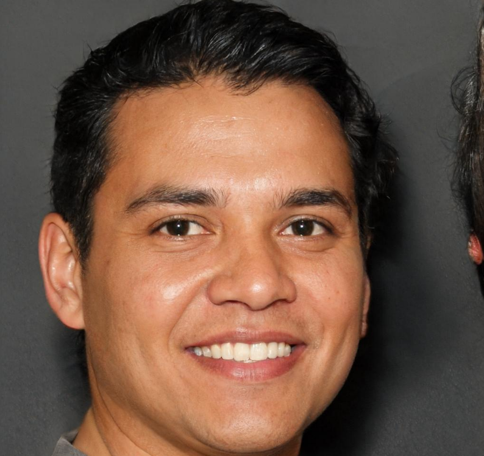
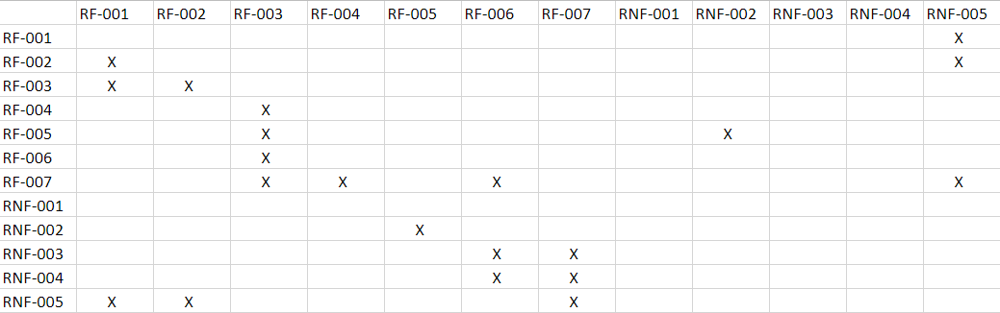
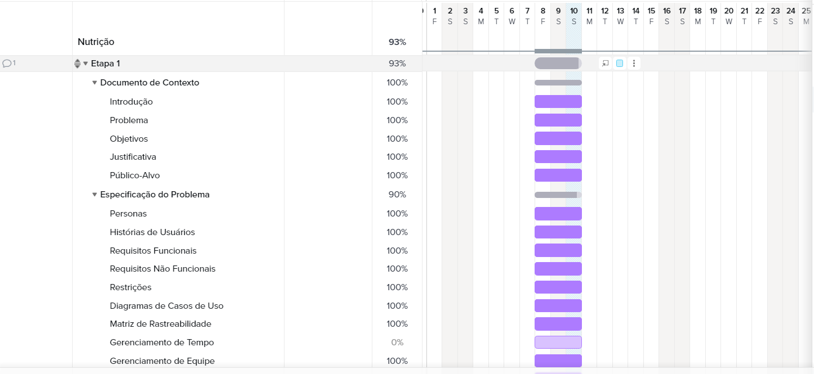
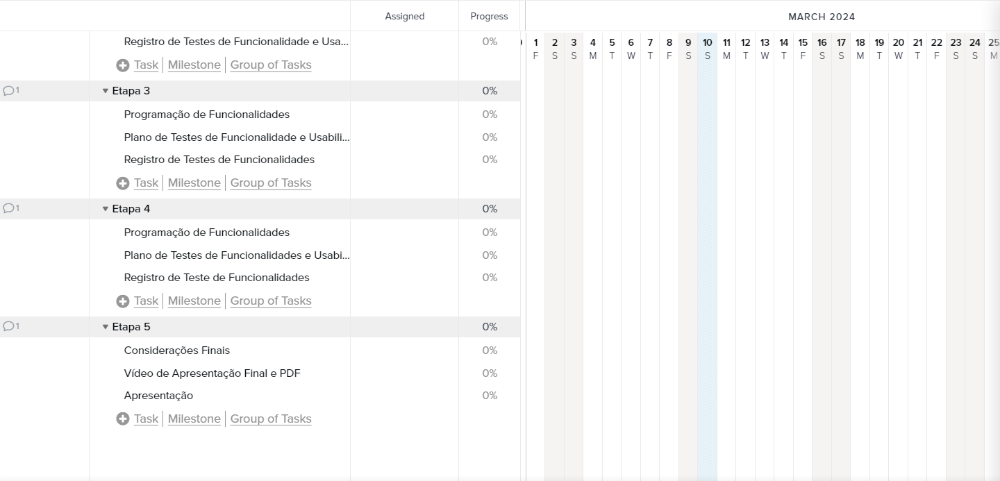
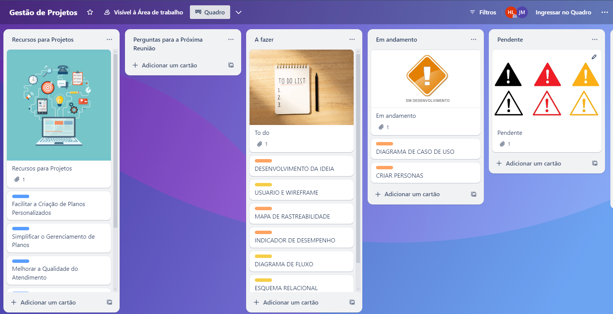

# Especificações do Projeto

A equipe se reuniu para discutir a definição do problema e, a partir disso, as possíveis soluções a partir da experiência dos usuários. Após isso, foi possível levantar os detalhes seguintes nessa seção.

## Personas

|   | **Joana Oliveira**   60 anos   |
|:---------------------------------------:|:-------------------------------:|
|**Ocupação** | Nutricionista especializada em alimentação saudável e bem-estar.
|**História** | Joana Oliveira sempre teve paixão por ajudar as pessoas a melhorarem sua qualidade de vida por meio da alimentação. Após anos de experiência em clínicas presenciais, decidiu dar um passo à frente e ingressar no mundo do trabalho remoto. Sua jornada começou a partir da necessidade de flexibilidade para conciliar a vida profissional e pessoal. Formada em Nutrição pela Universidade Federal, Joana buscou se aprimorar em tecnologias para otimizar a gestão de seus clientes.
|**Motivação** | Trabalhar remotamente como nutricionista e organizar os clientes de forma eficiente, utilizando ferramentas digitais para simplificar o processo.
|**Frustrações** | A dificuldade em organizar os clientes através de uma agenda convencional demanda muito tempo, buscando uma solução mais prática e moderna.|

|   | **Michelle de Paula**   36 anos  |
|:---------------------------------------:|:-------------------------------:|
|**Ocupação** | Nutricionista Esportiva e Coach Nutricional.
|**Históriao** | Michelle de Paula sempre foi uma entusiasta da tecnologia, mas encontrou desafios ao tentar integrar ferramentas digitais em seu trabalho como nutricionista. Formada em Nutrição pela Universidade Estadual, ela buscou especialização em nutrição esportiva e coaching nutricional. Sua paixão pela área a levou a querer criar métodos mais eficazes para compartilhar planos alimentares com seus clientes.
|**Motivação** | Desenvolver um método rápido e eficaz para compartilhar o plano alimentar de seus clientes, aproveitando as facilidades oferecidas pela tecnologia.
|**Frustrações** | Falta de afinidade com as ferramentas tecnológicas disponíveis, o que impede a agilidade e eficiência desejadas no processo de compartilhamento de informações.|

|   | **Tiago Ribeiro**   32 anos  |
|:---------------------------------------:|:-------------------------------:|
|**Ocupação** | Coach de Nutrição e Bem-Estar.
|**História** | Tiago Ribeiro trilhou um caminho diversificado na área da saúde, desde a formação em Educação Física até a especialização em coaching de nutrição e bem-estar. Com uma abordagem holística, Tiago sempre buscou métodos para registrar e acompanhar o progresso de seus clientes de maneira mais organizada.
|**Motivação** | Anotar e acompanhar o progresso de seus clientes de forma mais eficiente e organizada, utilizando tecnologias que facilitem a gestão de dados.
|**Frustrações** | Dificuldade em organizar todos os progressos de seus clientes em um único lugar, buscando uma solução integrada e de fácil acesso para melhorar a eficiência do coaching nutricional.|

|   | **Gustavo Silva**   21 anos  |
|:---------------------------------------:|:-------------------------------:|
|**Ocupação** | Estudante de Nutrição.
|**História** | Gustavo Silva é estudante de nutrição, atualmente no sexto período. Ingressou na área por paixão à alimentação saudável, e têm descoberto outras abordagens não convencionais na nutrição.
|**Motivação** | Ter experiência lidando com pacientes reais em estágio de Nutrição Clínica.
|**Frustrações** | Dificuldade em aprender sobre organização de pacientes, buscando alguma solução mais automatizada.|

## Histórias de Usuários

Com base na análise das personas foram identificadas as seguintes histórias de usuários:

|EU COMO... `PERSONA`| QUERO/DESEJO ... `O QUE` |PARA ... `PORQUE`                 |
|--------------------|------------------------------------|----------------------------------------|
|Joana Oliveira|	Trabalhar remotamente como nutricionista e organizar clientes de forma eficiente. | Ter mais flexibilidade na gestão de clientes e otimizar meu tempo para conciliar vida profissional e pessoal. |
|Michelle de Paula| Obter um método rápido de compartilhar o plano alimentar de seus clientes. | Aumentar a eficiência na entrega de planos alimentares, proporcionando melhor suporte e satisfação aos clientes. |
|Tiago Ribeiro|	Anotar o progresso de seus clientes de maneira organizada. | Facilitar o acompanhamento do progresso dos clientes, proporcionando um coaching mais eficaz e personalizado. |
| Gustavo Silva| Aprender sobre o processo de atender um cliente. | Ter um melhor desenvolvimento acadêmico e me tornar um bom profissional. |

## Modelagem de Processos de Negocio

### Análise da Situação Atual

A aplicação atualmente oferece uma solução eficaz para nutricionistas e profissionais da área na organização de planos alimentares personalizados para seus clientes, culminando na geração de PDFs profissionais. No entanto, ainda existem áreas de oportunidade para aprimoramento, como a integração de dados, desenvolvimento de recursos analíticos e suporte móvel. Investimentos nessas áreas podem não apenas melhorar a experiência do usuário, mas também aumentar a eficácia dos profissionais no suporte à saúde e nutrição de seus clientes.

### Descrição Geral da Proposta

A abordagem para modelar os processos de negócio neste projeto visa principalmente alinhar as estratégias desejadas, destacar o valor de cada processo e promover um entendimento compartilhado sobre o funcionamento das atividades, que servirão como base para o desenvolvimento da aplicação. O objetivo é estabelecer uma prática de melhoria contínua dos processos em toda a organização.

### Processo 1 - Criação Plano Alimentar com PDF

O processo começa com a coleta de informações do cliente, incluindo preferências alimentares e metas de saúde. Esses dados são então analisados para criar um plano alimentar personalizado, que é revisado e ajustado conforme necessário. Em paralelo, as informações do plano alimentar são utilizadas para gerar um documento PDF profissional, contendo detalhes relevantes como alimentos recomendados e horários de refeição. Enquanto o cliente segue o plano alimentar, seu progresso é monitorado e o plano é revisado periodicamente para garantir sua eficácia contínua. Esses processos combinados garantem uma abordagem holística para o suporte nutricional dos clientes, promovendo resultados positivos e satisfação.

## Indicadores de Desempenho 

## Requisitos

### Requisitos Funcionais

|ID    | Descrição do Requisito  | Prioridade |
|------|-----------------------------------------|----|
|RF-001| O aplicativo deve permitir o cadastro de um nutricionista.  | ALTA | 
|RF-002| O aplicativo deve permitir o login de um nutricionista.   | ALTA |
|RF-003| O aplicativo deve permitir a criação de um plano alimentar. | ALTA | 
|RF-004| O aplicativo deve permitir o gerenciamento de um plano alimentar. | MÉDIA | 
|RF-005| O aplicativo deve possuir a função de gerar um PDF do plano alimentar. | ALTA | 
|RF-006| O aplicativo deve apresentar uma tabela com os planos alimentares criados. | MÉDIA | 
|RF-007| O aplicativo deve possuir uma tela para anotações do profissional. | BAIXA | 

### Requisitos não Funcionais

|ID     | Descrição do Requisito  |Prioridade |
|-------|-------------------------|----|
|RNF-001| O aplicativo deve ser responsivo para rodar em um dispositivos móvel | MÉDIA | 
|RNF-002| O aplicativo deve gerar o PDF em até 10 segundos. |  ALTA | 
|RNF-003| O aplicativo deve possuir uma boa navegabilidade e usabilidade, facilitando a experiência do usuário. | MÉDIA | 
|RNF-004| O aplicativo deve ter bom nível de contraste entre os elementos da tela em conformidade. | BAIXA | 
|RNF-005| O aplicativo deve garantir a segurança dos dados do cliente. | ALTA | 

## Restrições

O projeto está restrito pelos itens apresentados na tabela a seguir.

|ID| Restrição                                             |
|--|-------------------------------------------------------|
|01| O projeto deverá ser entregue até o final do semestre |
|02| Não pode ser desenvolvido um módulo de backend        |

## Diagrama de Casos de Uso

# Matriz de Rastreabilidade

A matriz de rastreabilidade é uma ferramenta usada para facilitar a visualização dos relacionamento entre requisitos e outros artefatos ou objetos, permitindo a rastreabilidade entre os requisitos e os objetivos de negócio. 

# Gerenciamento de Projeto

O diagrama de Gantt foi tomado como modelo para equipe gerenciar o tempo do projeto.

## Gerenciamento de Tempo

## Gerenciamento de Equipe

O gerenciamento de equipe está sendo feito através do Trello.

## Gestão de Orçamento

