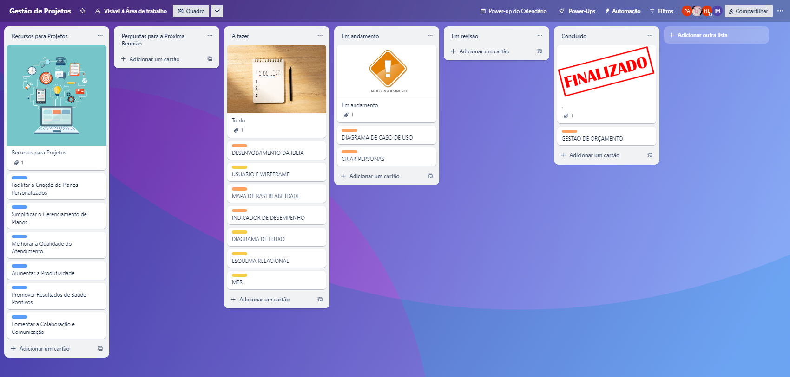

# Metodologia

A seguinte metodologia e maneira de trabalho em equipe foi definida:

## Ambientes de Trabalho

O projeto será desenvolvido a partir de plataformas de organização e gerenciamentos conforme a tabela abaixo:

|Artefato | Plataforma | Acesso |
|------|-----------------------------------------|----|
|Código fonte| Github | [Github](https://github.com/ICEI-PUC-Minas-PMV-ADS/pmv-ads-2023-1-e1-proj-web-t10-pmv-ads-2023-1-e1-proj-web-t10-buscapet) | 
|Prototipação interface| Figma | [Figma](https://www.figma.com/proto/V1fOP2HGdTcy3FqHmw3Z5c/Nutri%C3%A7%C3%A3o?type=design&node-id=1-3&t=EsI5hDYdhCa6Liae-0&scaling=scale-down&page-id=0%3A1&starting-point-node-id=1%3A3) | 
|Acompanhamento do projeto| Trello | [Trello](https://trello.com/b/rZErLmHH/gestão-de-projetos) | 

## Controle de Versão

A ferramenta de controle de versão adotada no projeto foi o
[Git](https://git-scm.com/), sendo que o [Github](https://github.com)
foi utilizado para hospedagem do repositório.

O projeto segue a seguinte convenção para o nome de branches:

- **`main:`** versão estável já testada do software

Quanto à gerência de issues, o projeto adota a seguinte convenção para
etiquetas:

- **`documentation:`** melhorias ou acréscimos à documentação
- **`bug:`** uma funcionalidade encontra-se com problemas
- **`enhancement:`** uma funcionalidade precisa ser melhorada
- **`feature:`** uma nova funcionalidade precisa ser introduzida

## Gerenciamento de Projeto

### Divisão de Papéis

A equipe utilizará metodologias ágeis, tendo escolhido o Scrum como base para definição do processo de desenvolvimento.

A equipe está organizada da seguinte maneira:

- **Scrum Master:** Pedro Henrique Argentino Dias
- **Product Owner:** Harttur Luiz Junio Diogenes da Silva
- **Equipe de Desenvolvimento:** Alessandra Thevenard Freire, Florisvaldo Alves Moreira Neto, Joao Marcos Macedo Goncalves
- **Equipe de Design:** Jose Luis Gomes Monteiro

### Processo

Para melhor organização está sendo utilizado o [Trello](https://trello.com/b/rZErLmHH/gestão-de-projetos) com as seguintes listas:

- **Recursos para projeto:** Todos os artefatos da solução que serão quebrados em tarefas etapas.
- **Perguntas para próxima reunião:** Parte destinada a organização de reuniões.
- **A Fazer:** Tarefas da etapa em desenvolvimento que precisam ser feitas e ainda não foram atribuídas a nenhum membro.
- **Em Andamento:** Todas as tarefas da etapa que estão sendo feitas por algum dos membros.
- **Em Revisão:** Tarefa que está sendo revisada por outro membro.
- **Concluído:** Todas as tarefas que foram concluídas.

### Ferramentas

As ferramentas empregadas no projeto são:

- **Editor de código:** Visual Studio Code, Github
- **Ferramente de comunicação:** Whatsapp, Discord, Microsoft Teams
- **Ferramenta de desenho de tela:** Figma
- **Ferramenta de diagramação:** Lucidapp
- **Ferramenta de design de banco de dados:** MySQL Workbench
