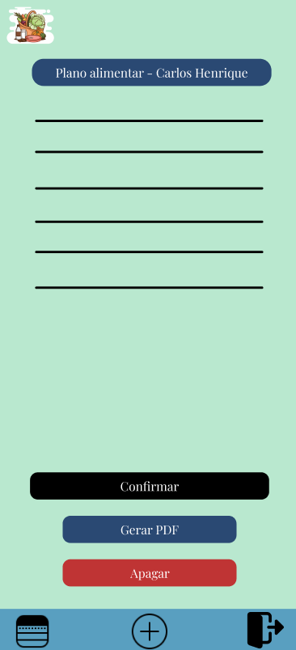

# Projeto de Interface

## Diagrama de Fluxo

## Wireframes

A visualização interativa pode ser feita através do [Figma](https://www.figma.com/proto/V1fOP2HGdTcy3FqHmw3Z5c/Nutri%C3%A7%C3%A3o?type=design&node-id=1-3&t=EsI5hDYdhCa6Liae-0&scaling=scale-down&page-id=0%3A1&starting-point-node-id=1%3A3).

### Tela - Inicial

### Tela - Login

### Tela - Cadastro

### Tela - Principal

### Tela - Planos alimentares

### Tela - Gerenciamento

### Tela - Anotações

