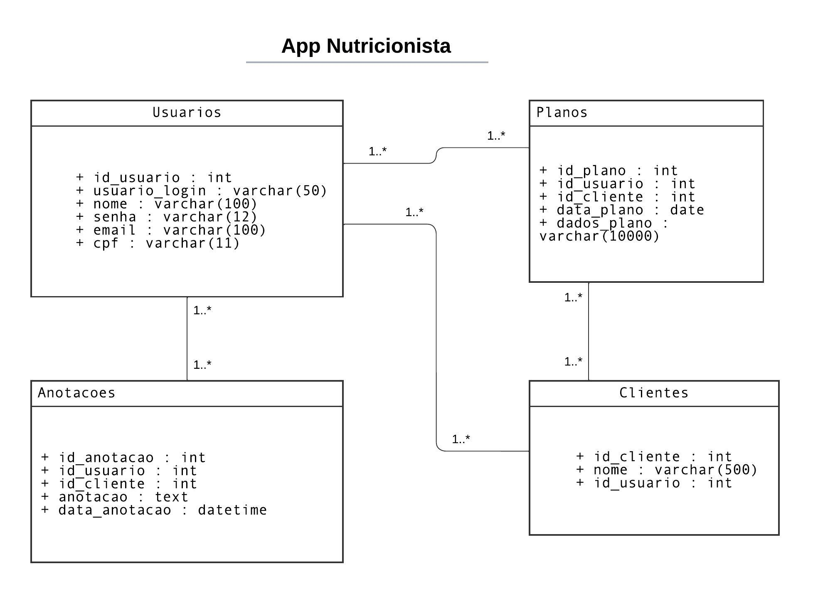
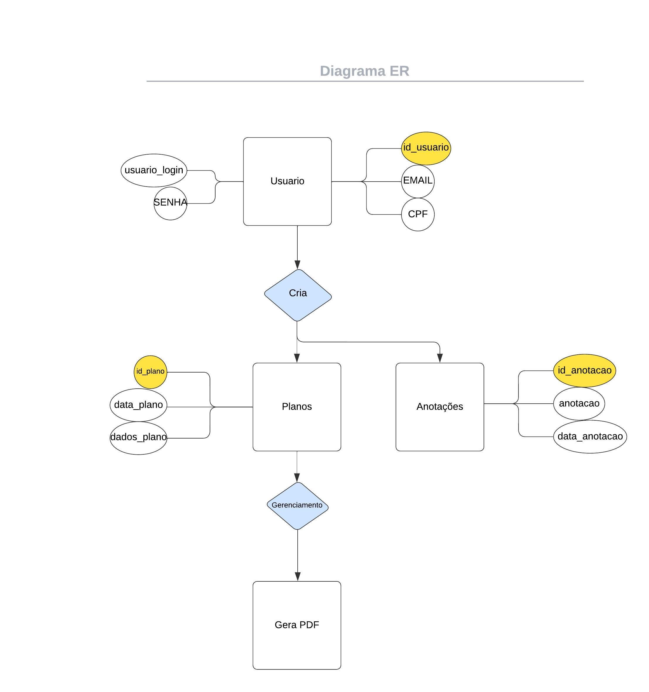
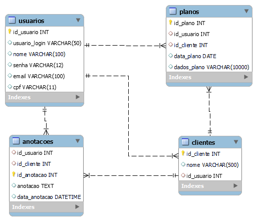

 # Arquitetura da Solução

Definição de como o software é estruturado em termos dos componentes que fazem parte da solução e do ambiente de hospedagem da aplicação.

[Arquitetura de Solução](https://docs.google.com/document/d/1yCzT9-JJdWGmjANxiSPjRDJBLYxt3Q87/edit?usp=sharing&ouid=108228207139159687860&rtpof=true&sd=true)

## Diagrama de Classes

## Modelo ER

## Esquema Relacional

## Modelo Físico
O arquivo de script da criação das tabelas do banco de dados pode ser encontrado na pasta src.

<a href="docs/src"> Script App Nutricionista</a>

## Tecnologias Utilizadas

Structured Query Language (SQL)

## Hospedagem

Explique como a hospedagem e o lançamento da plataforma foi feita.

> **Links Úteis**:
>
> - [Website com GitHub Pages](https://pages.github.com/)
> - [Programação colaborativa com Repl.it](https://repl.it/)
> - [Getting Started with Heroku](https://devcenter.heroku.com/start)
> - [Publicando Seu Site No Heroku](http://pythonclub.com.br/publicando-seu-hello-world-no-heroku.html)

## Qualidade de Software

### Funcionalidade

O aplicativo deve apresentar todas as funcionalidades para gestão do plano alimentar de um paciente.

### Confiabilidade

O aplicativo deve ser confiável e garantir a segurança dos dados do nutricionista e de todos os seus clientes, além da segurança das notas escritas no app.

### Usabilidade

O aplicativo deve ser simples e direto, não deixando brechas para confusão e permitindo uma navegação rápida.

### Eficiência

O aplicativo deve ser eficaz na geração de PDF independente de seu tamanho, proporcionando uma experiência suave para o usuário.

### Manutenibilidade

O aplicativo deve ser desenvolvido com código simples e que permita novas atualizações e implementações.

### Portabilidade

O aplicativo deve ser responsivo em todos os aplicatívos móveis disponíveis no mercado.
