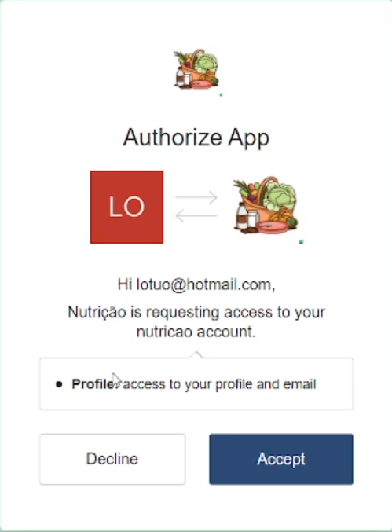

# Registro de Testes de Software

## RF-001: Cadastro de Nutricionista (ALTA) Descrição: O aplicativo deve permitir que um nutricionista se cadastre

Cenário de Teste 1: Registro Bem-Sucedido

Cenário de Teste 2: Registro com Dados Inválidos

### RF-002: Login de Nutricionista (ALTA) Descrição: O aplicativo deve permitir que um nutricionista faça login

Cenário de Teste 1: Login Bem-Sucedido

Cenário de Teste 2: Login com Credenciais Inválidas

